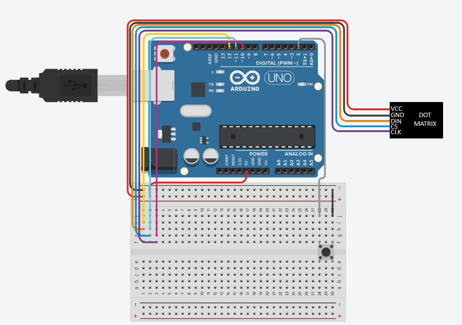

# Arduino-Flappy-Dot
Simple Flappy bird style game on an arduino and an 8x8 Dot matrix display!
## Info:
* The player dot is constantly falling
* Pressing the button moves the player up
* Obstacles move across the screen from right to left
* Position of the gap in the obstacle is randomly generated
* You can adjust a variable named 'gameSpeed' to change the difficulty of the game
* Upon coliding with an obstacle or falling off the bottom of the dot matrix, a game over screen occurs
* Game over screen displays a sad face, then your score (represented as 1 pixel = 1 point)

## Components: 
* Arduino board (any should do)
* Breadboard
* MAX7219 DotMatrix Module
* Button set as pull-up resistor
* 5 F-M Cables
* 7 M-M Cables

### Wiring Guide for Breadboard:

